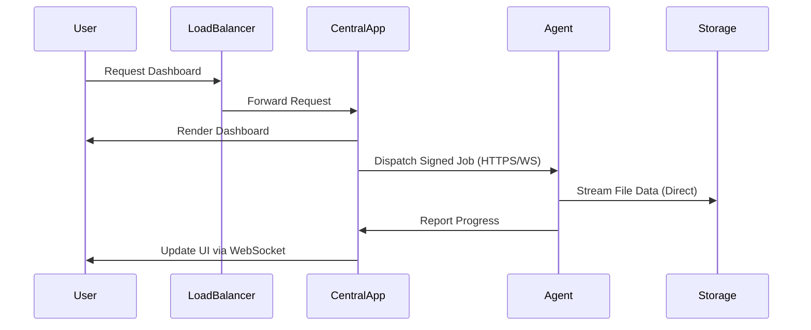

# Multi-Tenant Unified File Transfer & Batch Host Management System
*A Comprehensive Architectural and Systems Engineering Analysis*

## Executive Summary
This paper details the architecture, design, and implementation of a unified multi-tenant platform encompassing two primary systems: **BatchHost-Pro** (a Batch File Management & Monitoring system) and **FileBridge** (a Multi-tenant Server file transfer and management system). The solution incorporates a centralized authentication portal that enforces role-based access control (RBAC) and tenant isolation across multiple organizations. Designed for enterprise-scale deployments, the system utilizes a control-plane and data-plane separation model, ensuring highly available, secure, and scalable file operations across cross-platform environments (Windows, Linux).

## Problem Statement
Modern enterprise environments require secure, high-throughput file transfer and batch processing capabilities across heterogeneous OS ecosystems. Existing solutions often lack cohesive multi-tenancy, requiring separate authentication silos and fractured management planes. There is a critical need for a centralized platform that unifies authentication, ensures strict tenant isolation (per-organization), and efficiently manages remote agents executing critical file operations without routing massive data payloads through central application servers.

## System Overview
The proposed system is an integrated platform featuring:
1. **Central Auth Portal**: A single sign-on (SSO) gateway managing access to all downstream services.
2. **BatchHost-Pro**: A specialized system for managing batch files and monitoring operations.
3. **FileBridge**: A robust file transfer and synchronization system managing endpoint agents.

The system leverages a Flask monolithic backend acting as the control plane, with lightweight endpoints (agents) executing the data-plane operations via HTTPS polling and WebSockets.

## Multi-Tenant Architecture
The architecture is designed to support multiple organizations within a single deployment. The system uses logical isolation at the database level and application-level filtering based on an `organization_id` bound to the user's session.

### Tenant Isolation Model
- **Data Isolation**: All database schemas include `organization_id` foreign keys. Application logic enforces that users can only query and mutate records matching their assigned organization.
- **Agent Isolation**: Endpoint agents are registered to specific organizations. File transfer jobs and execution commands are strictly scoped to agents belonging to the authenticated user's organization.

### Authentication Portal
The Central Auth Portal provides a unified SSO experience. It validates credentials against a shared user database and returns a short-lived launch token for target systems (BatchHost-Pro or FileBridge).

```mermaid
flowchart TD
    A[User visits /login\n(Central Auth Portal)] --> B[Enter credentials\n(email + password)]
    B --> C[POST /api/auth/login]
    C --> D{Valid?}
    D -- Yes --> F[Return user profile + allowed systems]
    F --> G[System Selection Screen]
    G --> H[BatchHost-Pro Login]
    G --> I[FileBridge Login]
```

### Authentication & Authorization
The platform uses server-side Flask sessions for state management. Upon successful login at the central portal, a one-time launch token is generated and verified by the target system's SSO endpoint. 

### Organization Management
Organizations are the top-level logical boundary. Super administrators have global visibility across all organizations, while organization administrators are constrained to their respective tenants.

### User & Role Management
Three primary roles govern access:
1. `super_admin`: Global access across all organizations and systems.
2. `organization_admin`: Full access within their assigned organization.
3. `organization_viewer`: Read-only access within their assigned organization.

## BatchHost-Pro Architecture
BatchHost-Pro serves as the batch execution and monitoring engine. It interfaces with registered servers to execute scheduled and ad-hoc batch scripts, collecting standard output and error logs in real-time.

## FileBridge Architecture
FileBridge provides managed file transfer capabilities. It utilizes a centralized scheduler and job signer that dispatches secure transfer instructions to edge agents. 

## Agent Architecture (Windows & Linux)
Agents execute operations close to the file systems, utilizing:
- **Linux/Ubuntu Agents (`agent.sh`)**: Operations via SSH/SFTP.
- **Windows Agents (`agent.bat`)**: Operations via WinRM/SMB.
Agents communicate with the control plane via HTTPS polling and WebSockets for real-time signaling.

## Service Deployment (WinSW, systemd, RPM)
- **Windows**: Agents and services are wrapped using WinSW to run as native Windows Services.
- **Linux (RHEL/Ubuntu)**: Services are managed via `systemd`. Deployment is facilitated via RPM packages for Red Hat-based systems or deb packages for Debian-based systems.

## Database Design & ERD Explanation
The primary data store is a MySQL relational database acting as the source of truth for users, organizations, agents, and job histories.
*Key entities include:* `Organizations`, `Users`, `Agents`, `Sync_Jobs`, `Transfer_Logs`, and `Audit_Logs`.

## API Architecture
The backend exposes a RESTful API for control plane operations. The API strictly enforces role-based access and tenant isolation on every request via decorator-based authorization middleware.

## Security Architecture
- **Transport Security**: All communication occurs over HTTPS (TLS termination at the load balancer).
- **Data-Plane Security**: Agents utilize short-lived, signed job payloads to prevent spoofing or replay attacks.
- **CSRF Protection**: State-mutating endpoints enforce CSRF tokens.

## Audit Logging & System Logging
Comprehensive audit logs track every administrative action (e.g., job creation, user modification). System logs capture detailed agent telemetry, backend exceptions, and scheduler activities.

## High Availability & Reliability
The system is designed for high availability through stateless Flask application workers (Waitress/Gunicorn) behind an Nginx/HAProxy load balancer. The MySQL database utilizes a Primary-Replica configuration for failover.

## Scalability Considerations
The control-plane/data-plane split ensures the central server is not bottlenecked by massive file payloads. WebSockets handle real-time UI updates, while agents perform heavy lifting locally.

## Performance Optimization
- Offloading file transfers directly between servers where possible.
- Caching frequent queries (e.g., session validation).
- Using WebSocket multiplexing for real-time dashboard metrics.

## Monitoring & Observability
System metrics are exposed via a Prometheus `/metrics` endpoint and visualized using Grafana dashboards, tracking agent health, transfer throughput, and API latency.

## Deployment Architecture (RHEL, Windows)
The recommended topology involves deploying the central web application on Linux (RHEL/Ubuntu) VMs, with agents deployed across the distributed infrastructure on both Windows and Linux endpoints.

## Network Flow Diagrams


## Data Flow Diagrams
```text
[Source Server] --(Direct Data Stream)--> [Destination Server]
      |                                        |
 (Job Status)                             (Job Status)
      |                                        |
      v                                        v
[ Centralized Flask Control Plane (FileBridge) ]
```

## Technology Stack
- **Frontend**: HTML5, CSS3, Vanilla JavaScript, Bootstrap
- **Backend Control Plane**: Python 3.12/3.13, Flask, Waitress/Gunicorn
- **Database**: MySQL
- **Agent Technologies**: WinRM, SMB, SSH, SFTP
- **Infrastructure**: Nginx, systemd, WinSW

## Installation & Deployment Guide
1. **Database**: Provision MySQL and run `seed_mysql.py` / `schema.sql`.
2. **Backend App**: Clone repository, install dependencies (`requirements.txt`), and configure `.env`.
3. **Agent Deployment**: Distribute the `.rpm` (Linux) or WinSW wrappers (Windows) to target machines.
4. **Proxy**: Configure Nginx for TLS termination and WebSocket proxying.

## Configuration Management
Configurations are managed via environment variables (`.env`) and local JSON files (`systems.json`, `users.json` for fallback/auth portals) ensuring secrets are kept out of source control.

## Backup & Recovery
Automated cron jobs create daily logical backups (`mysqldump`) of the MySQL database, stored securely in an isolated Object Storage bucket.

## Disaster Recovery Strategy
In the event of a primary site failure, traffic is rerouted to a secondary failover site containing a read-replica promoted to primary. Stateless application nodes can be quickly spun up via auto-scaling groups.

## Appendix
- Detailed Agent Installation Scripts
- API Endpoint Reference

## Glossary
- **SSO**: Single Sign-On
- **RBAC**: Role-Based Access Control
- **WinSW**: Windows Service Wrapper
- **Data-Plane**: The part of a network that carries user traffic.
- **Control-Plane**: The part of a network that manages the data-plane.

## Author
**Wahid Jamadar** <br>
*Python Developer & AI Engineer*
